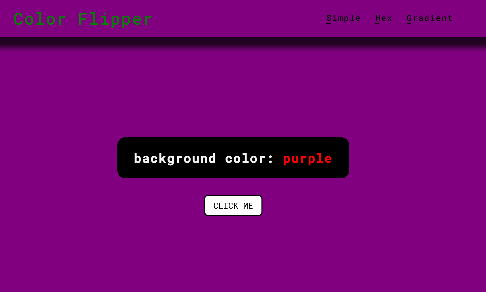
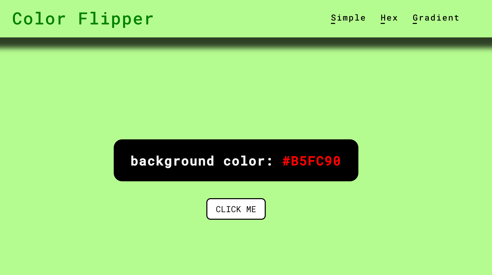
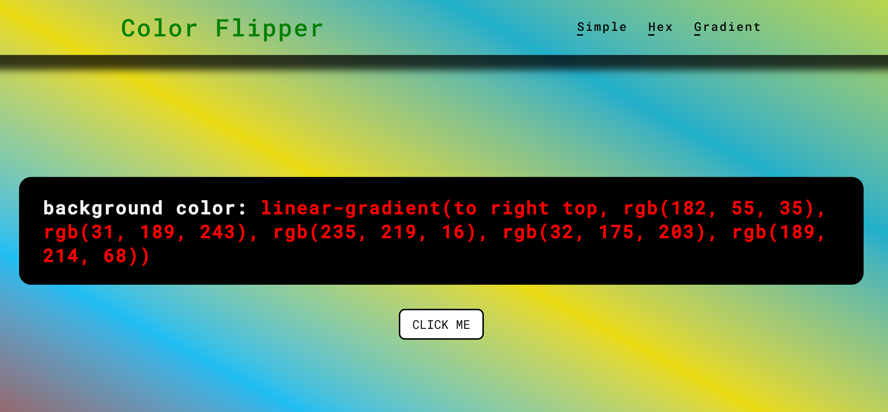

# Exchange Rate App Calculator Project

This is a simple web application that allows the user to view three different color pickers. The three different color pickers are simple, hex and gradient mode.

- Simple consists of a fixed array of values
- Hex consists of hexadecimal color values
- Gradient consists of gradient hexadecimal color values

Note: While the colors generated are in hexa code, the CSS properties displayed are in RGB values as they are automatically being converted in the CSS properties. 

## Features

- Three different color pickers.
- Users can copy colors.

## Project Structure

The project is structured as follows:

todo-app/

- `app/`: Directory containing JavaScript files.
  - `main.js`: Contains the main app logic and interaction for the simple picker.
  - `hex.js`: Contains the main app logic and interaction for the hex picker.
  - `gradient.js`: Contains the main app logic and interaction for the gradient picker.
- `styles/`: Directory containing CSS and SCSS files for styling.
  - `style.css`: Compiled CSS file.
  - `style.scss`: SCSS source file.
  - `style.css.map`: Source map for SCSS to CSS mapping.
  - `global.scss` : Golbal settings for app
- `index.html`: The main HTML file that contains the structure of the simple color picker.
- `hex.html`: The hex HTML file that contains the structure of the hex color picker.
- `gradient.html`: The main HTML file that contains the structure of the gradient color picker.
- `readme.md`: The README file containing project information and instructions.

## Getting Started

1. Clone this repository: `git clone <repository-url>`
2. Open the `index.html` file in a web browser.
3. Start adding, editing, and managing your tasks!

## Application Technologies

- HTML5
- SCSS
- Vanilla Javascript

## Screenshots

## Links

Project URL: https://magenta-naiad-e67d61.netlify.app/

## Contributing

Contributions are welcome! If you find any issues or have ideas for improvements, feel free to submit a pull request.
